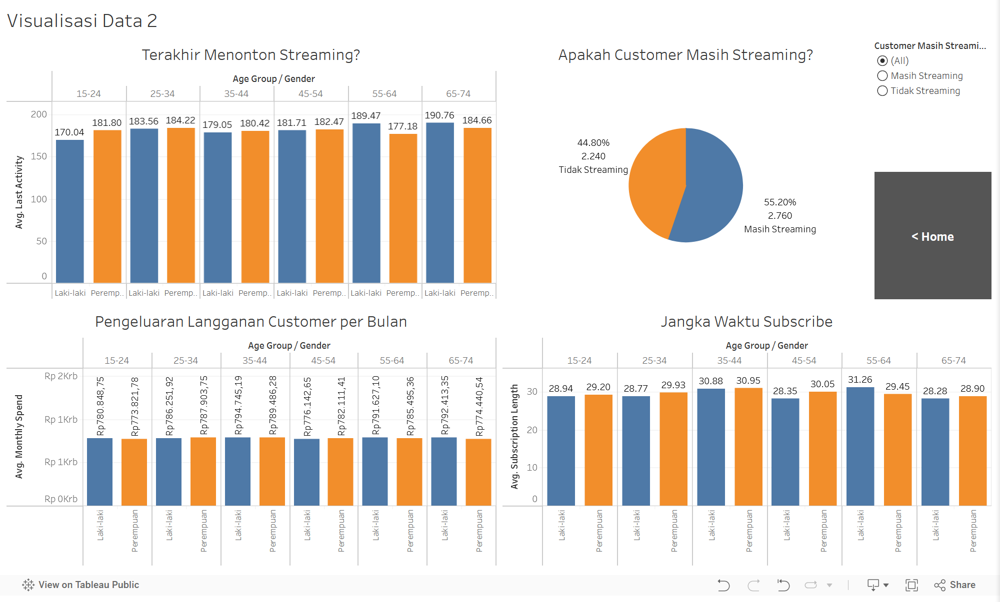

# Analisis Streaming Service Data

## Repository Outline
<!-- `Bagian ini menjelaskan secara singkat konten/isi dari file yang dipush ke repository` -->
| File | Deskripsi |
| - | - |
| `README.md` | Penjelasan gambaran umum project |
| `data_analysis.ipynb` | Notebook yang berisi pengolahan data dengan python |
| `streaming-service-data.zip` | Data Mentah Streaming Service dari [Kaggle @akashanandt](https://www.kaggle.com/datasets/akashanandt/streaming-service-data) |
| `streaming.csv` | Data Mentah Streaming Service dari file kompresi streaming-service-data.zip yang sudah diekstrak menjadi file CSV |
| `streaming_clean.csv` | Data Streaming Service hasil pengolahan |
| `plot/` | Direktori berisi gambar plot dari notebook |
| `tableau/` | Direktori berisi gambar screenshot Dashboard Tableau |

## Problem Background
<!-- `Bagian ini menjelaskan masalah yang diselesaikan pada project ini beserta latar belakang masalahnya secara singkat` -->
Analisis Streaming Service Data dibuat untuk menganalisis data streaming service dari sumber luar, untuk menganalisis demografi dan gambaran perilaku dari customer streaming service.

## Project Output
<!-- `Bagian ini menjelaskan secara singkat output projectnya apa, misal model machine learning, dasboard, dsb.` -->
Output dari project ini adalah hasil analisis demografi dan perilaku customer yang dikemas dalam bentuk Dashboard di Tableau.

## Data
<!-- `Bagian ini menjelaskan secara singkat mengenai data yang digunakan seperti sumber data, deskripsi singkat karakteristik data seperti jumlah kolom, baris data, missing values, dsb` -->
Dataset diambil dari [Kaggle @akashanandt](https://www.kaggle.com/datasets/akashanandt/streaming-service-data), yang terdiri dari 5.000 baris dan 12 kolom. Ada 2 kolom dengan missing values, yaitu kolom `Age` dan kolom `Satisfaction_Score`.
| No. | Kolom | Jenis Data | Kosong? | Deskripsi |
| - | - | - | - | - |
| 1 | `Customer_ID` | Kategorikal | - | ID customer dengan menggunakan pengkodean dalam format tertentu. |
| 2 | `Age` | Numerik Desimal | `500` | Umur customer dalam bentuk desimal. |
| 3 | `Gender` | Kategorikal | - | Jenis kelamin customer. |
| 4 | `Subscription_Length` | Numerik Diskrit | - | Berapa lama customer telah melakukan _subscribe_ (dalam satuan bulan). |
| 5 | `Region` | Kategorikal | - | Wilayah asal customer. |
| 6 | `Payment_Method` | Kategorikal | - | Metode pembayaran customer. |
| 7 | `Support_Tickets_Raised` | Numerik Diskrit | - | Jumlah tiket bantuan yang telah diajukan oleh customer. |
| 8 | `Satisfaction_Score` | Ordinal | `500` | Nilai kepuasan customer (1 = tidak puas dan 10 = sangat puas). |
| 9 | `Discount_Offered` | Numerik Desimal | - | Diskon yang telah ditawarkan ke customer (satuan dalam dolar). |
| 10 | `Last_Activity` | Numerik Diskrit | - | Berapa lama customer tidak mengunjungi streaming service dalam hitungan hari. |
| 11 | `Monthly_Spend` | Numerik Desimal | - | Jumlah pengeluaran customer pada streaming service (satuan dalam dolar). |
| 12 | `Churned` | Kategorikal | - | Apakah customer sudah tidak mengikuti streaming. `1` untuk tidak mengikuti dan `0` bila masih mengikuti |

## Method
<!-- `Bagian ini menjelaskan metode yang digunakan pada project, misal project ini mengenai machine learning sehingga metode yang dipakai adalah model supervised learning dengan model KNN` -->
Metode yang digunakan dalam proses analisis adalah:
  1. Uji korelasi dengan teknik Pearson dan Kendall
  2. Uji hipotesis dengan jenis Two-Sided Two-Sample Independent Test, ANOVA Test, dan Chi-Squared Test

## Stacks
<!-- `Bagian ini menjelaskan stacks yang digunakan seperti bahasa pemrograman, tools, dan library Python yang digunakan` -->
Project ini menggunakan bahasa pemrograman Python, dengan library berikut:
  1. Numpy
  2. Pandas
  3. Scipy
  4. Matplotlib
  5. Seaborn

Tools tambahan yang digunakan pada project ini yaitu Tableau sebagai Dashboard visualisasi data.

## Running Notebook
Terdapat beberapa hal yang harus diperhatikan jika notebook akan di-running:
  1. Notebook akan membuat dan menimpa file gambar plot pada direktori plot/
  2. File hasil data cleaning streaming_clean.csv akan tertimpa dengan data hasil cleaning yang baru. Karena ada konversi mata uang dengan memakai API pada saat proses data cleaning, maka kemungkinan besar file akan tertimpa seluruhnya.
  3. Proses konversi bisa dinonaktifkan dengan menonaktifkan kode pada bagian `IV > A > 4 > b. Kode Opsional untuk mengambil nilai tukar USD ke IDR terkini dari API Internet`

## Dashboard
Hasil analisis bisa diakses pada [Tableau Public berikut](https://public.tableau.com/app/profile/elang.cergas.pembrani/viz/FTDS_P0M1/Dashboard?publish=yes).

Terdapat 2 halaman visualisasi data yang bisa diakses dengan menekan tombol `Visualisasi Data`, dan juga terdapat 9 halaman Penjabaran Masalah yang bisa diakses dengan menekan masing-masing tombol `Go >`.

### Tampilan Tableau - Dashboard

### Tampilan Tableau - Visualisasi Data 1

### Tampilan Tableau - Visualisasi Data 2

### Tampilan Tableau - Penjabaran Masalah #1

### Tampilan Tableau - Penjabaran Masalah #2

### Tampilan Tableau - Penjabaran Masalah #3

### Tampilan Tableau - Penjabaran Masalah #4

### Tampilan Tableau - Penjabaran Masalah #5

### Tampilan Tableau - Penjabaran Masalah #6

### Tampilan Tableau - Penjabaran Masalah #7

### Tampilan Tableau - Penjabaran Masalah #8

### Tampilan Tableau - Penjabaran Masalah #9

## Reference
<!-- `Bagian ini berisi link pendukung seperti referensi, dashboard, atau deployment` -->

---

**Referensi tambahan:**
- [Sumber Dataset Kaggle @akashanandt](https://www.kaggle.com/datasets/akashanandt/streaming-service-data)
